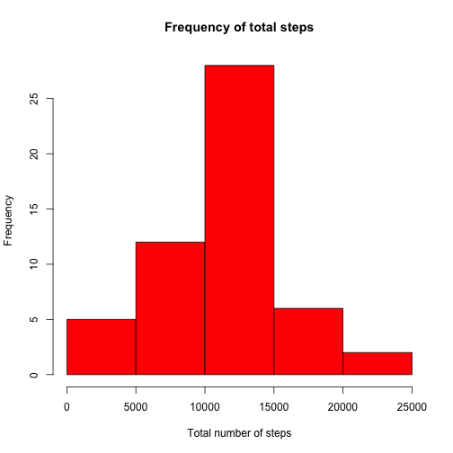
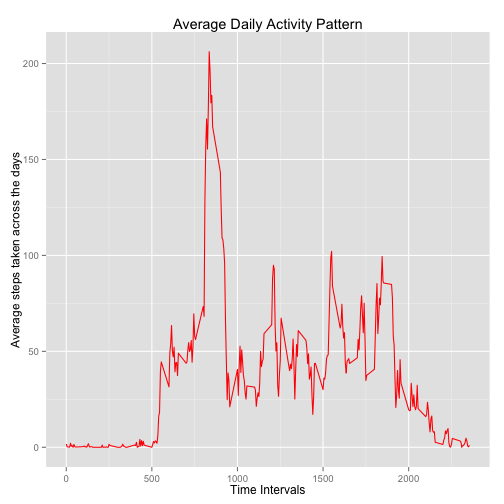
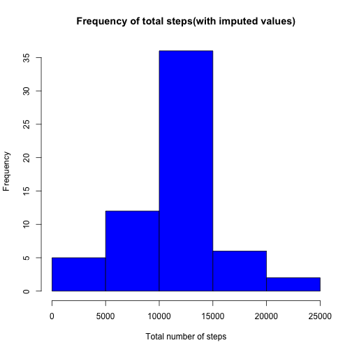
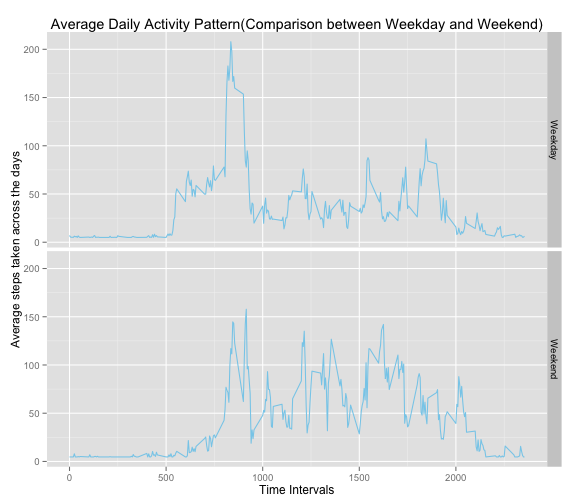

#Reproducible Research - Assessment 1

Loading and preprocessing the data
=====================================

The code will first call the list of packages that will be used throughout this code.  
It will then check if *activity.csv* has been extracted from the zip file.  
Upon extraction, the *date* column will converted to a Date variable for easier processing as it is a Factor variable.  
The data frame **activity** will always contain the original dataset. Variations of the original dataset will be made to answer each question.


```r
library(dplyr)
library(lubridate)
library(ggplot2)
library(knitr)
```


```r
if (!file.exists("activity.csv"))
{unzip("activity.zip")}
activity <- read.csv("activity.csv", header = TRUE)
activity$date <- as.Date(activity$date, format = "%Y-%m-%d")
activity <- tbl_df(activity)
```

What is mean total number of steps taken per day?
=================================================

A copy of **activity** was made with the "NA" values removed.  
The data frame is grouped by date and the sum of the steps were tabulated.  

```r
activity2 <- activity
activity2 <- activity2[complete.cases(activity2),]
activity2 <- activity2 %>% group_by(date) %>% summarize(total_steps = sum(steps))
```
Below is the histogram of the total number of steps taken for each day.

```r
hist(activity2$total_steps, col = "red", main = "Frequency of total steps", xlab ="Total number of steps")
```

 

The **mean and median** total number of steps taken per day is as follows:

```r
mean(activity2$total_steps)
```

```
## [1] 10766.19
```

```r
median(activity2$total_steps)
```

```
## [1] 10765
```

## What is the average daily activity pattern?

"NA" values were removed for the tabulation of the average daily activity pattern.  
The data frame is grouped by intervals and the mean of the steps were tabulated.  
The mean of the steps were also rounded to 2 decimal place.


```r
activity3 <- activity
activity3 <- activity3[complete.cases(activity3),]
activity3 <- activity3 %>% group_by(interval) %>% summarize(ave_steps = mean(steps))
activity3$ave_steps <- round(activity3$ave_steps, digits =2)
```

Below is the time series plot of the 5-minute interval and the average number of steps taken, averaged across all days. 

```r
g <- ggplot(activity3, aes(interval, ave_steps))
g<- g + geom_line(colour ="red") + labs(x = "Time Intervals") + labs(y= "Average steps taken across the days") + labs(title = "Average Daily Activity Pattern")
print(g)
```

 

Time interval **835** registered the maximum number of steps.

```r
activity3 <- arrange(activity3, desc(ave_steps))
head(activity3)
```

```
## Source: local data frame [6 x 2]
## 
##   interval ave_steps
## 1      835    206.17
## 2      840    195.92
## 3      850    183.40
## 4      845    179.57
## 5      830    177.30
## 6      820    171.15
```

Imputing missing values
=======================

The total number of "NA" values in the original dataset is **2304**.  

```r
summary(activity$steps)
```

```
##    Min. 1st Qu.  Median    Mean 3rd Qu.    Max.    NA's 
##    0.00    0.00    0.00   37.38   12.00  806.00    2304
```

The strategy adopted for imputing missing values in the dataset is via the use of mean steps of the entire dataset. As shown in the output above, the mean steps of the original dataset is **37.38**.  Thus, **37.38** will be used to replace all the "NA" in the original dataset.

As shown in the code below, **37.38** is being used to replace all the "NA" values.  
The data frame is grouped by date and the sum of the steps were tabulated.


```r
activity4 <- activity
activity4$steps[is.na(activity4$steps)] <- 37.38
activity5 <- activity4 %>% group_by(date) %>% summarize(total_steps = sum(steps))
```

Comparison of histograms depicting two datasets

```r
hist(activity5$total_steps, col = "blue", main = "Frequency of total steps(with imputed values)", xlab ="Total number of steps")
```

 

```r
hist(activity2$total_steps, col = "red", main = "Frequency of total steps(with NA values removed)", xlab ="Total number of steps")
```

 

As seen in the mean and median values below after imputing missing values, it is similar to the mean and median values of the dataset with "NA" values removed which is **10766.19** and **10765** respectively. As observed in the comparison of the histograms above, higher frequecy were registered for steps 10000-15000 for the histogram with imputed missing values.


```r
mean(activity5$total_steps)
```

```
## [1] 10766.09
```

```r
median(activity5$total_steps)
```

```
## [1] 10765.44
```

Are there differences in activity patterns between weekdays and weekends?
========================================================================

Data frame **activity4** is the data frame that contains the imputed missing values.  
A new variable, **weekday_weekend**, was added to the dataset to show the days of the week based on the **Date** variable.  
Monday to Friday is then subsituted with **Weekday** and Saturday to Sunday is subsituted with **Weekend**.
The variable **weekday_weekend**, is then converted to a factor variable.  
The data frame is grouped by interval and weekday_weekend and the mean of the steps were tabulated.
The mean of the steps were also rounded to 2 decimal place.


```r
activity6 <- activity4
activity6$weekday_weekend <- weekdays(activity6$date)
activity6$weekday_weekend <- gsub("Monday|Tuesday|Wednesday|Thursday|Friday", "Weekday", activity6$weekday_weekend)
activity6$weekday_weekend <- gsub("Saturday|Sunday", "Weekend", activity6$weekday_weekend)
activity6$weekday_weekend <- factor(activity6$weekday_weekend)
activity6 <- activity6 %>% group_by(interval, weekday_weekend) %>% summarize(ave_steps = mean(steps))
activity6$ave_steps <- round(activity6$ave_steps, digits =2)
```

Below is the time series plot of the 5-minute interval and the average number of steps taken, averaged across all weekday or weekend days. 


```r
g1 <- ggplot(activity6, aes(interval,ave_steps))
g1 <- g1 + geom_line(colour ="skyblue") + facet_grid(weekday_weekend ~ . ) +  labs(x = "Time Intervals") + labs(y= "Average steps taken across the days") + labs(title = "Average Daily Activity Pattern(Comparison between Weekday and Weekend)")
print(g1)
```

 


